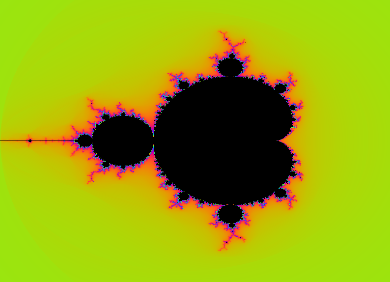
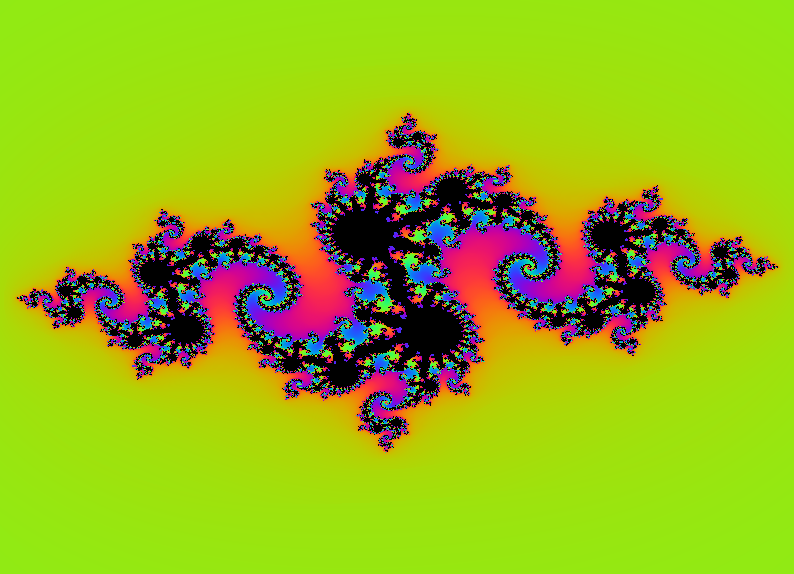

# Fract'ol - 42 School Project


Fract'ol is a project from the 42 School curriculum that explores the fascinating world of fractals using the MiniLibX graphical library. This program renders beautiful mathematical fractals in real-time, with interactive controls for exploration.

<!-- Imagens lado a lado -->
<p align="center">
  
  
</p>

## Table of Contents
- [About](#about)
- [Features](#features)
- [Supported Fractals](#supported-fractals)
- [Installation](#installation)
- [Usage](#usage)
- [Controls](#controls)
- [Project Structure](#project-structure)
- [Technical Details](#technical-details)
- [License](#license)

## About

Fract'ol is an educational project that demonstrates the use of complex mathematics and computer graphics to generate fractal patterns. It implements the MiniLibX library (a simple X-Window interface) to create an interactive visualization of mathematical fractals.

The project explores concepts such as:
- Complex number arithmetic
- Fractal mathematics (Mandelbrot and Julia sets)
- Graphical programming with X11
- Event handling and user interaction
- Optimization techniques for real-time rendering

## Features

- 🖼️ **High-quality fractal rendering** with smooth coloring
- 🔍 **Interactive zooming** with mouse scroll wheel
- 🖱️ **Click-based navigation** (zoom centers on cursor position)
- 🎨 **Dynamic color schemes** with smooth gradients
- ⚡ **Optimized rendering** for real-time performance
- 🔄 **Multiple fractal types** with parameter customization

## Supported Fractals

### Mandelbrot Set
The classic fractal that reveals increasingly detailed patterns as you zoom in.

Usage:
```bash
./fractol mandelbrot
```

### Julia Set
A related fractal that requires complex parameter inputs to generate different patterns.

Usage:
```bash
./fractol julia -0.8 0.156
```

## Installation

### Prerequisites
- GCC compiler
- X11 development libraries
- Make

On Debian/Ubuntu:
```bash
sudo apt-get update
sudo apt-get install gcc make xorg libxext-dev libx11-dev
```

On Fedora/RHEL:
```bash
sudo dnf install gcc make libX11-devel libXext-devel
```

### Compilation

1. Clone the repository:
```bash
git clone https://github.com/Ferreira-Jefferson/fract-ol
cd fractol
```

2. Build the project:
```bash
make
```

This will compile the fractol executable along with the required libft and MiniLibX libraries.

## Usage

Run the program with one of the following commands:

**Mandelbrot Set:**
```bash
./fractol mandelbrot
```

**Julia Set (with custom parameters):**
```bash
./fractol julia -0.8 0.156
```

The Julia set requires two floating-point parameters representing the real and imaginary parts of the complex constant.

## Controls

- **Mouse Scroll Up**: Zoom in (centered on cursor position)
- **Mouse Scroll Down**: Zoom out (centered on cursor position)
- **ESC Key**: Close the window and exit the program
- **Window Close Button**: Close the program

## Project Structure

```
fractol/
├── fractol.c              # Main program entry point
├── utils.c                # Utility functions (color, pixel drawing)
├── utils_fractol.c        # Fractal calculation algorithms
├── utils_control.c        # Event handling (keyboard, mouse)
├── utils_setup.c          # MiniLibX initialization
├── includes/              # Header files
│   ├── fractol.h          # Main header
│   ├── structs.h          # Data structures
│   ├── utils.h            # Utility function declarations
│   ├── utils_fractol.h    # Fractal function declarations
│   ├── utils_control.h    # Control function declarations
│   └── utils_setup.h      # Setup function declarations
├── libft/                 # Custom C library (42 School standard)
├── minilibx/              # MiniLibX graphical library
├── objs/                  # Object files directory
├── Makefile               # Build configuration
└── LICENSE                # GNU GPL v3 license
```

## Technical Details

### Fractal Algorithm
The program uses an iterative algorithm to determine if points in the complex plane belong to the fractal set. For each pixel:
1. Convert screen coordinates to complex plane coordinates
2. Apply the fractal formula iteratively
3. Track how quickly the sequence diverges (if at all)
4. Map the iteration count to a color value

### Smooth Coloring
The implementation uses a continuous coloring technique that provides smoother gradients than discrete escape-time algorithms:

```c
smooth_iter = (double)iter + 1.0 - log(log(sqrt(z_real*z_real + z_imag*z_imag))) / log(2.0);
```

### Performance Optimizations
- Pre-calculated coordinate transformations
- Efficient iteration counting with early termination
- Direct pixel manipulation with MiniLibX

## License

This project is licensed under the GNU General Public License v3.0 - see the [LICENSE](LICENSE) file for details.

This means you are free to:
- Use the software for any purpose
- Study how the program works and adapt it
- Redistribute copies
- Improve the program and release your improvements

---

*Project developed as part of the 42 School curriculum*